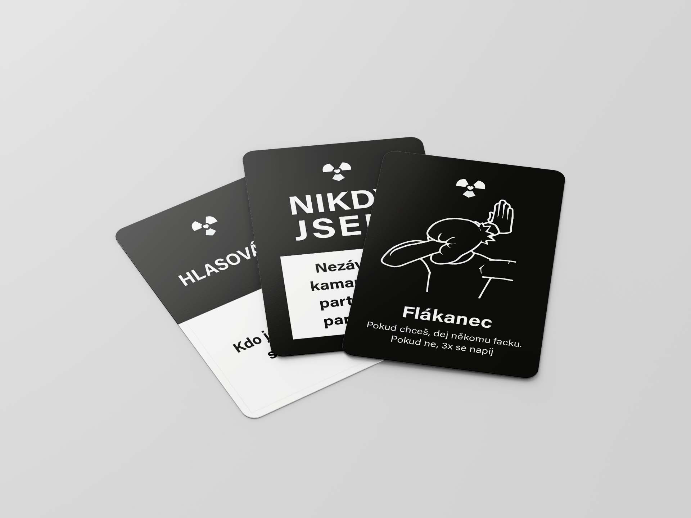
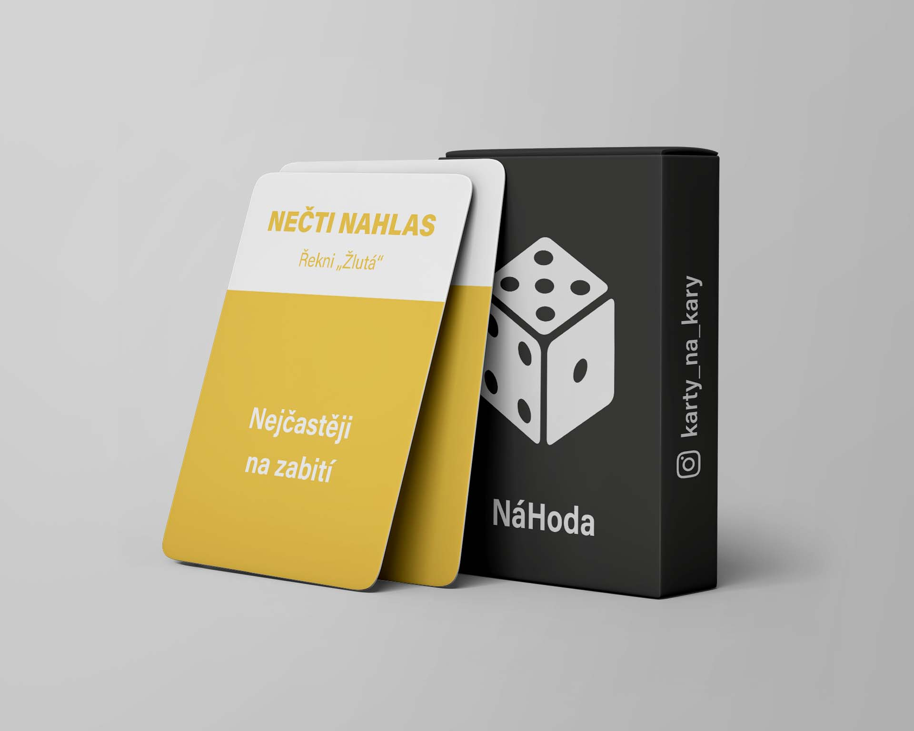

# “Na Káry” (Black out)

## Project background

**Year of realization:** fall 2020-2021

**TL;DR:** Process behind drinking card game “Na Káry”. Project started as personal, on demand was made into an actual game, first only digitally then physically, the whole process took approximately 8 months. Cards have minimalistic design, mostly black and white. Game has 7 different decks.

### Beginning of the idea
This project started last year as a personal project. It all began in summer with me playing a drinking card game with a normal set of playing cards, and then trying to find some similar game in czech language, but with specialized cards.
After searching and finding literally nothing, I decided to create my own set of cards for my personal needs. I created a few cards and put them on my tiktok account. It caught quite a bit of traction and people were asking whether it would be sold. Hence why I created my very own deck of cards.

### First decks
I began with creating 3 decks of cards. Each deck contained 70 different cards and were themed. 
Basic deck: Basic drinking cards, for example: Single people drink, ladies drink, finish your drink, and few dare and action cards
Sex deck: Cards containing questions and dares regarding personal sex life
Fun deck: Fun dares, main purpose of this deck is to have fun and being silly

When the idea was that the cards would only be for my personal needs, I wanted to create them in english and I wanted it to be called “Black out”, but since the demand to make these cards in czech got higher, I decided to change the language. Hence all of the cards being black and having minimalistic design, because they were supposed to be called “Black out” and I kinda liked the design so it stuck.

At this stage, I was selling them only via digital copies. I didn’t have manufacturer and it was around exam period in school, so selling physical copies got postponed until summer of 2021, because finding a printing house and creating and printing the actual cards took approximately 5months.

### Physical decks
I started selling my cards physically in mid-July. At this time I already had 5 decks with 2 more coming in October. They all start with the letters “Na”, because the game is called “Na Káry” and I wanted all the decks to have a cohesive title.
NAdržení (Horny) - originally called “sex deck” - about personal sex life
NAdržení NA druhou (Horny2) - sequel to Horny - more cards about sex
NAsmátí (foolish) - originally called “fun deck” - about being silly
NAzdar (hello) - cards to get to know people, questions you wouldn’t normally ask but they tell you a lot about the person
NÁhoda (coincidance) - add-on to basic deck, isn’t themed, just new style of playing cards
NAštvaní (angry) - toxic cards, designed to test friendships

### Design
All of the cards have black background, with most of them being only black and white. They have a minimalistic design. On the back of each card is the title “Na Káry” but it is designed to be hard to look at, because it gives you the feeling of being already drunk. Each deck of cards has a unique symbol to mark the type of deck it is from. 

Box is always only black and white, with the logo, official instagram tag and link of the website on the sides. On one side is always the unique symbol of the deck and the other side is same as the back of the cards.

