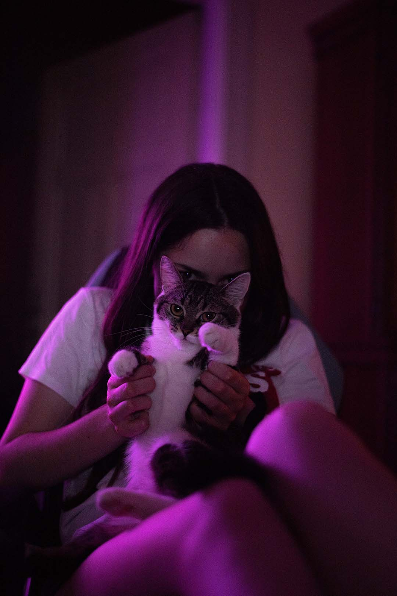

# Nicole John

## About me

Hello! I am Nicole John, graphic designer, artist, CEO in company specializing in drinking games and a cat mom.

See my  here!

## My story

Describing myself in a few words might be a bit of a pickle. Sometimes, I amaze myself. And sometimes I throw my keys in the trash. Generally, I'd like to think myself to be friendly, reliable, punctual and a team player, but I tend to gravitate more towards being the leader.

In design I mainly look for the fun idea behind it, so word play and puns are my go-to, but I also love tiny easter eggs in design. I like taking the artistic approach rather than the typographic, it’s just not my type!

When facing new challenges I like to try my hardest and also try to push other people around me to do their best too. I’ve gained most of my experience not by self-teaching, but by asking and observing people around me. My strongest ability is probably finding the most effective way to do things, as well as bringing people together to achieve the best possible result.

*“Give me ten good men and some climbing spikes. I’ll impregnate the b**ch.”* - Bronn, Game of Thrones

