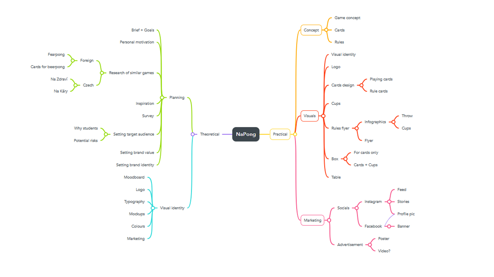

<!-- Table of Contents, in-page navigation -->

- [Summary](#summary)
- [Mind Map](#mind-map)
- [Keywords](#keywords)
- [Key Points](#key-points)
- [References](#references)
- [Inspiration](#inspiration)
- [Warm-Up](#warm-up)

# NaPong – new drinking game
---
## Summary

NaPong is add-on card game to existing drinking game Beerpong. My thesis focuses on game concept, design and advertisement – mainly on social media. My goal is to create fully-functioning and intuitive game to enrich gameplay of one of the most played college games in the US, and to bring it to Czechia with the intent of selling the product myself.

  
<b>Mind Map</b>

  

## Keywords

- Drinking game, Board game, Students, College, Student life, Advertisement, Graphic design, Visual identity, Socials, Marketing

## Key Points

<!-- Key points; aim for **30–60 words** each. -->

1. Background/importance of topic: Extension of czech market in "student" games
2. Purpose/hypothesis (thesis or statement of problem):
3. Research — design/methodology/approach including procedures/data/observations:
4. Findings (highlight outcome of research):
5. Conclusions (significance/success of study to theory/practical/society):

## References

<!-- Add reference list. See Reference List Style -->

- …
- …
- …

## Inspiration

<!-- Optional section, see https://evajunkova.github.io/english-for-designers/08-clarity-first/#inspiration -->

## Warm-Up

In class exercise: Explore key points with the PAR method, then write a statement.

1. Problem:
2. Action:
3. Result:

<!-- Put it all together in a statement -->

PAR statement:
