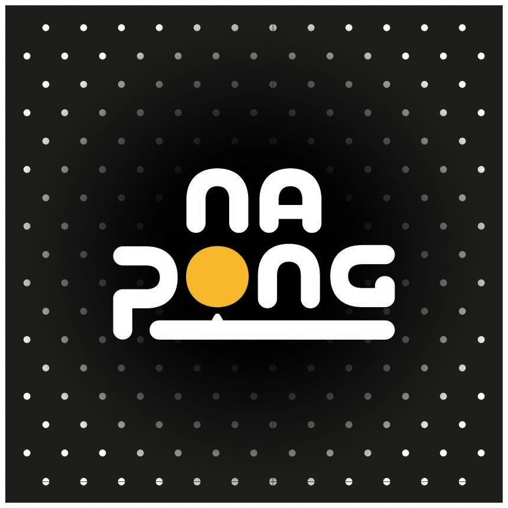
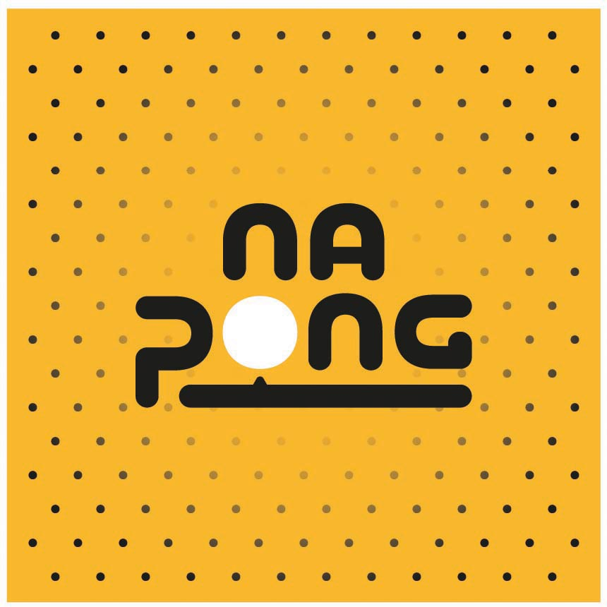
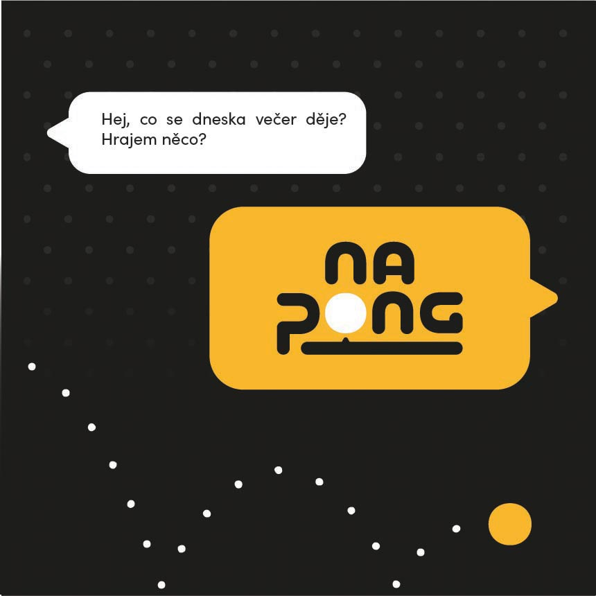
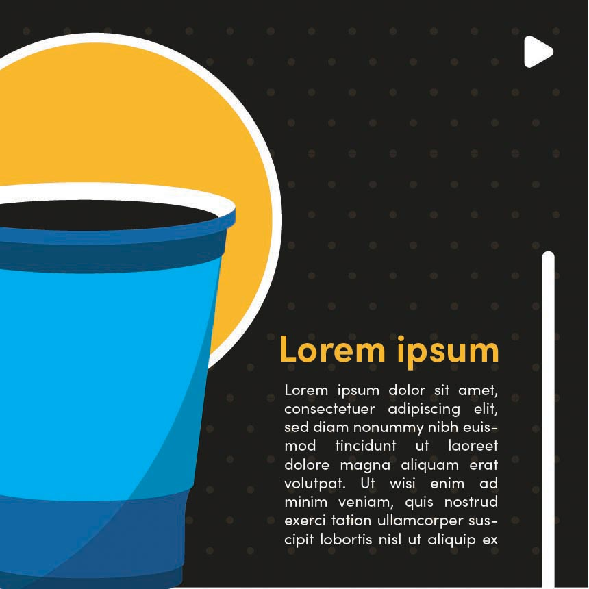
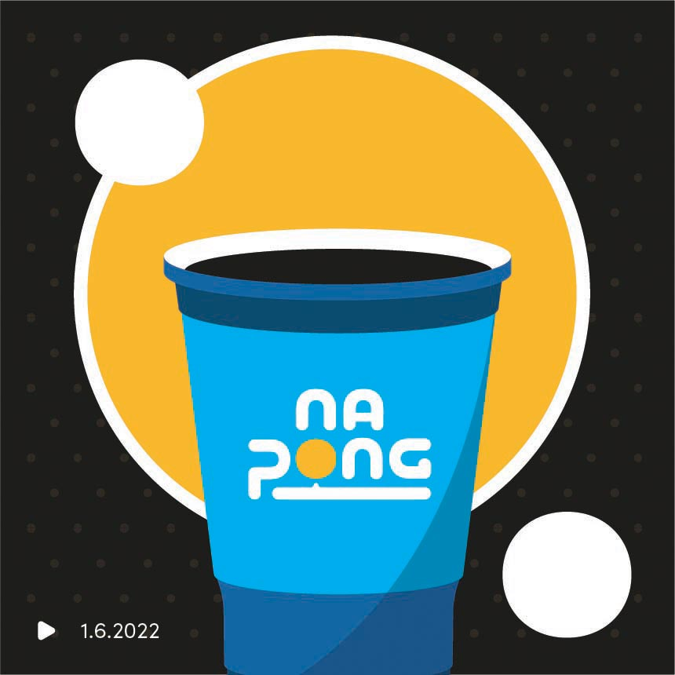

# Concept and design of a new game NaPong

## Abstract

Based on my previous experience with games and starting my own business, I wanted to create something that will expand my sortiment. The idea came from multiple occasions of playing the game "beer pong", and being bored as a spectator after a few rounds. My goal is to create concept of an add-on game that will entertain multiple people at once and will enrich the gameplay itself. My thesis will focus on creating such game, as well as it's initial advertisement on social media.

## Keywords

Drinking game, Board game, Students, College, Student life, Advertisement, Graphic design, Visual identity, Socials, Marketing

## Presentation (WIP)

<!-- Work-in-progress thesis presetation. -->

  
  
 
