Title: Digest: Concept and design of a new game NaPong

Author Name(s): Nicole Johnová

E-mail(s): nici.john@gmail.com

Acknowledgement(s): I would like to thank the supervisor of my bachelor thesis, Mr. doc. Joachim Rindler for all the valuable advice, willingness and experience he offered and provided to me not only during my writing this thesis, but also during my years of university studies. I would also like to thank my family and friends for their support and patience.

# Digest: Concept and design of a new game NaPong

## Main Text

Based on my previous experience with drinking games and starting my own business, I wanted to create something that will expand my sortiment. The idea came from multiple occasions of playing the game “Beer Pong”, and being bored as a spectator after a few rounds. My goal is to create concept of an add-on game that will entertain multiple people at once and will enrich the gameplay itself. This expansion should work in a way that under each cup will be a card, that will somehow make the gameplay different, such as – "throw with your non-dominant hand" or "fill back 1 cup". It is aiming to enrich the gameplay and make it a game not only about skill, but also about luck and mainly, fun. 

I want to reach out of my comfort zone and step up my game in creating games. My project should not only fill the market, but also be sort of a guide on how to create such game from creating the concept of the game to advertisement. It should also give an insight on what work is needed to bring it to life. 

## Keywords

drinking game, board game, students, college, student life, advertisement, graphic design, visual identity, socials, marketing

I started participating in the field of board games in the autumn of 2020, when I started creating a card game, which started selling in the summer of 2021. The game I created is called "Na Káry" and is created for the purposes of social events, that are mainly associated with drinking alcohol. Based on this game, I then found out that there is not a large representation of games of this type on the Czech market and there is a lot of interest in them, especially among young people, mostly students. In my bachelor's thesis, I will therefore try to create another social game associated with drinking alcohol, conceptually and visually different from mine and other existing games in the Czech Republic.

The new game is going to be called NaPong. NaPong is an extension of the world-famous alcohol game Beer Pong in the form of cards with tasks under individual cups. The initial impulse to the creation was the participation of several tournaments in Beer Pong as part of the after-school activities of the College of Creative Communication and finding that the spectator gets bored after a few rounds of the game. During the basic game, there may be a loss of attention over time due to repetition. The main goal is to make the game more interesting for both players and spectators and to enrich the gameplay.
Based on the questionnaire conducted for this work, 80% of respondents in the Czech Republic know the game Beer Pong and 68% have played it before, with more than 75% of respondents interested in expanding the basic game.

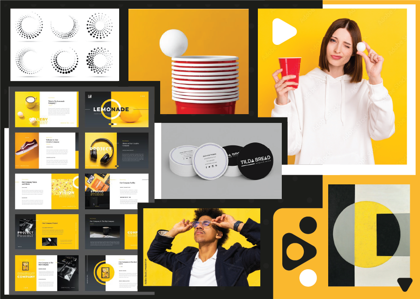
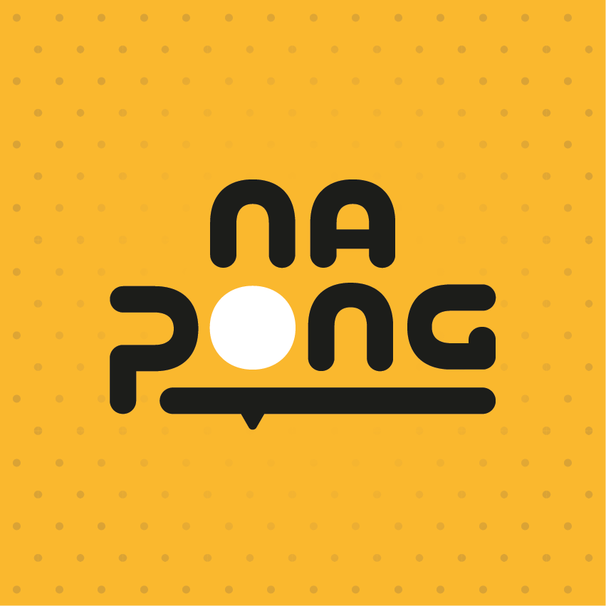  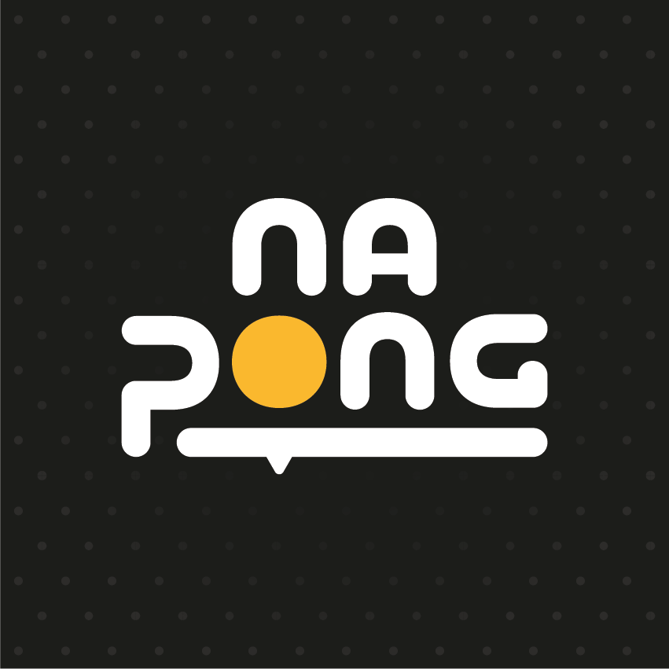

The main idea of the game is expansion in the form of cards, which are located under each of the individual cups. They are round and contain various tasks, rules and challenges that players must perform. There are two types, yellow cards and black cards.
- Yellow card - This card determines the rule for one game, eg "Throw with a non-dominant hand" - ie. that the whole game players throw only with a non-dominant hand.
- Black card - There is going to be one black card under each cup. When the opponent hits the cup, the player takes the card, does what is written on it, drinks, and only then does the game continue. The players in each team take turns drinking (thus also performing tasks).
Each game is completely unique, as there are numerous combinations of yellow and black cards. It is important to mention that the game can be played with both alcoholic and non-alcoholic beverages, so it is entirely up to the players which option to choose. At the same time, emphasis is placed on the fact that no player is obliged to drink alcohol and they decide for themselves whether they feel comfortably with the tasks or if they are in a dangerous situation. In this case, the game can be stopped at any time.

 
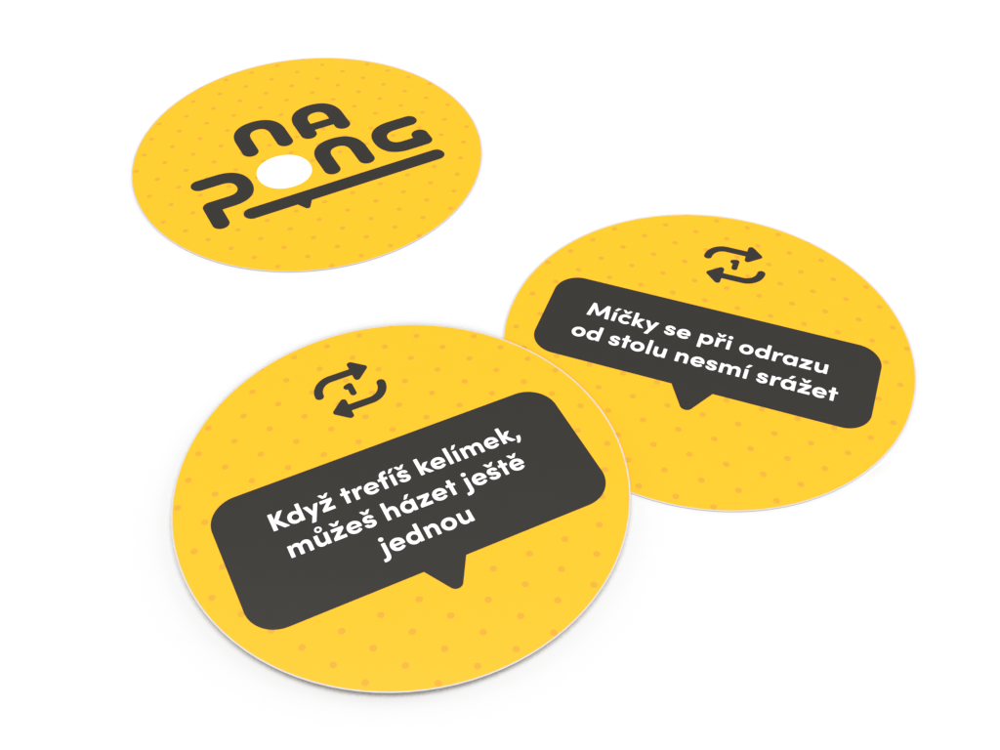

There are two types of packaging:
Smaller one - The smaller package will only contain the rules and the playing cards themselves. I chose this option for several reasons. The first is the possibility of a cheaper option, associated with environmental protection. Many potential players already own cups at home, whether hard plastic or paper ones, the game can also be played with glasses, so there is no need to add NaPong cups. Another argument is better portability, a small package is more convenient when traveling. At the same time, this option will certainly please you thanks to cheaper costs, which will be reflected in the total price of the final product.

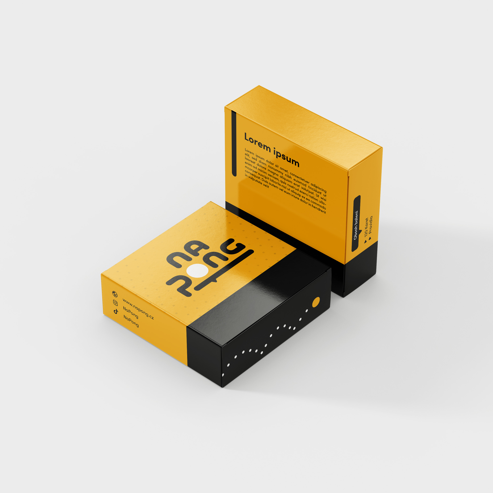 

Bigger one - The larger package will include playing cards, rules, 22 hard plastic cups and 2 ping pong balls. This set contains everything except the beverages needed for the game, the player has all the necessary parts in one package. This version will of course be more expensive than the small version, but it provides more convenience in preparing for the game itself.

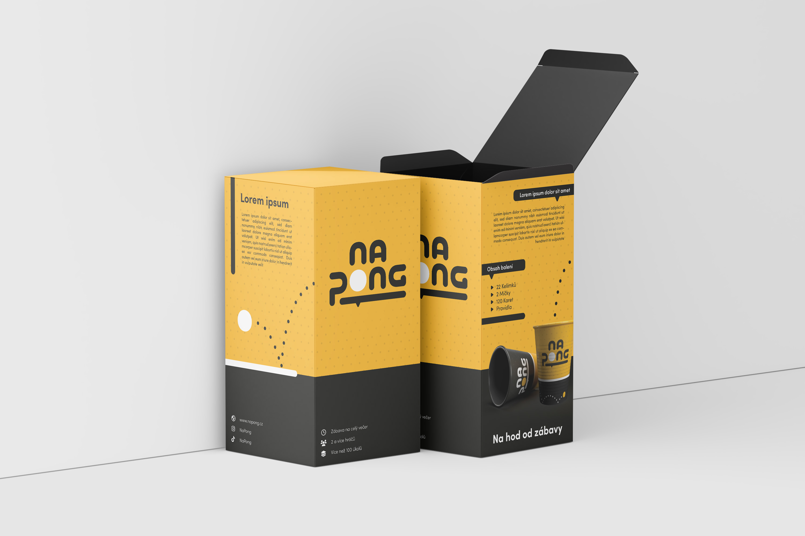
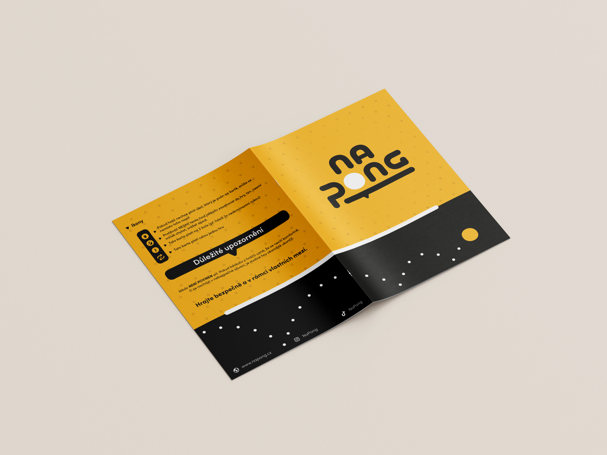 
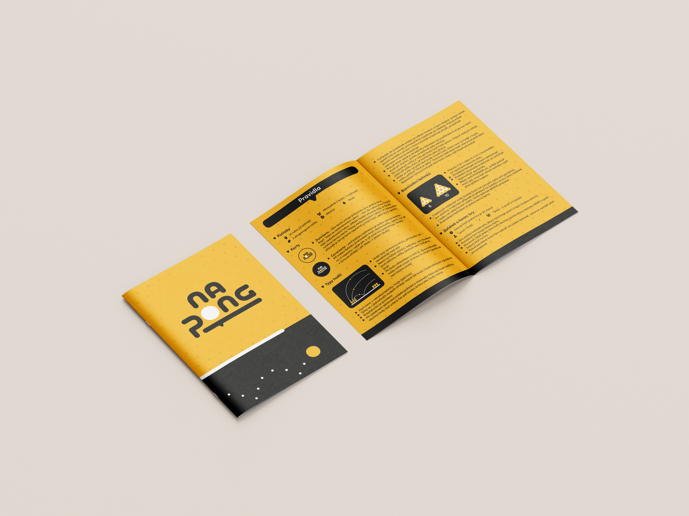

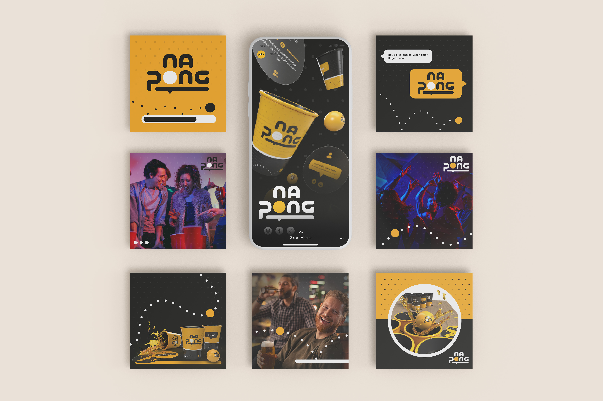 

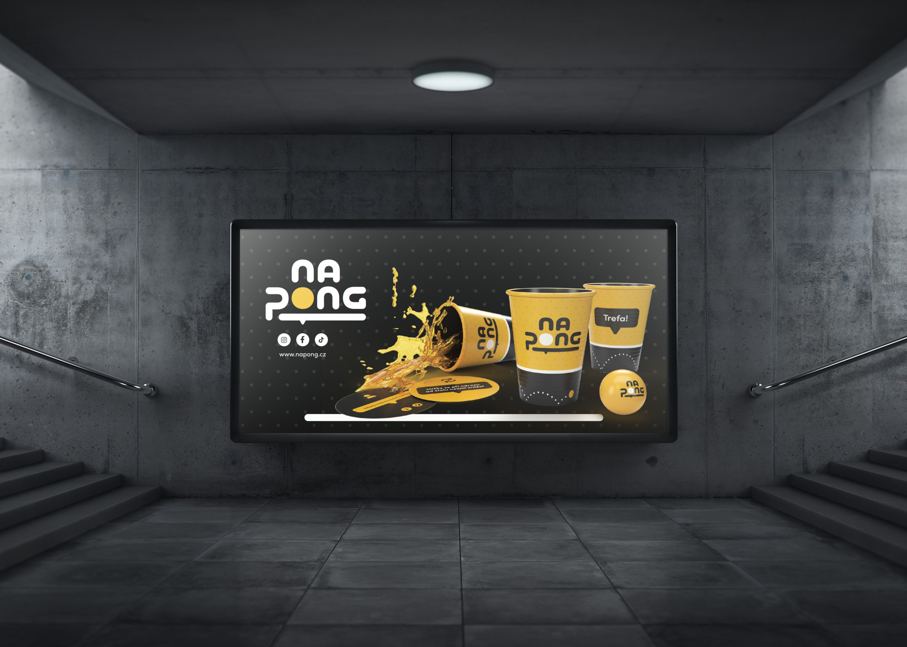
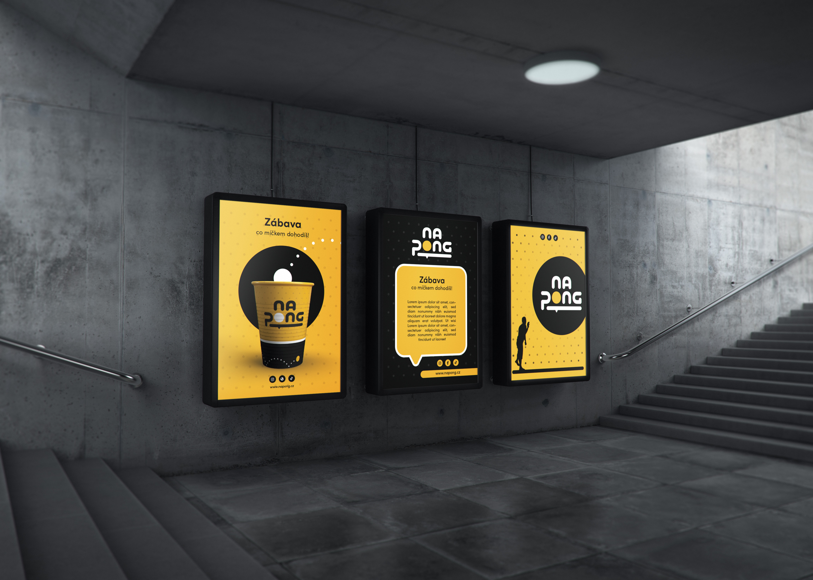
