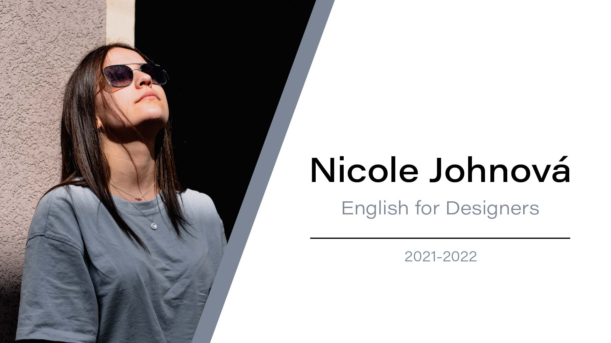

# Nicole Johnová

---
## About me
Hello! I am Nicole John, graphic designer, artist, CEO in company specializing in drinking games and a cat mom.

Check out my [about page](03-aboutness/) to get to know me more. Here is my online version of [CV](04-experience/).

See my [current project](03-aboutness/case-study.md) here.

## Coursework over the year

[Character Description](01-character-description/)

[Impression](02-impression/)

[Aboutness](03-aboutness/)

[Experience](04-experience/)

[Voice and tone](05-voice-tone/)

[Storytelling]() - WIP

## Takeaways
- Complex writing doesn´t necessarily mean better
- Your text can be read by anyone, adjust your language
- Started using GitHub
- Good writing doesn´t just happen, it takes time
